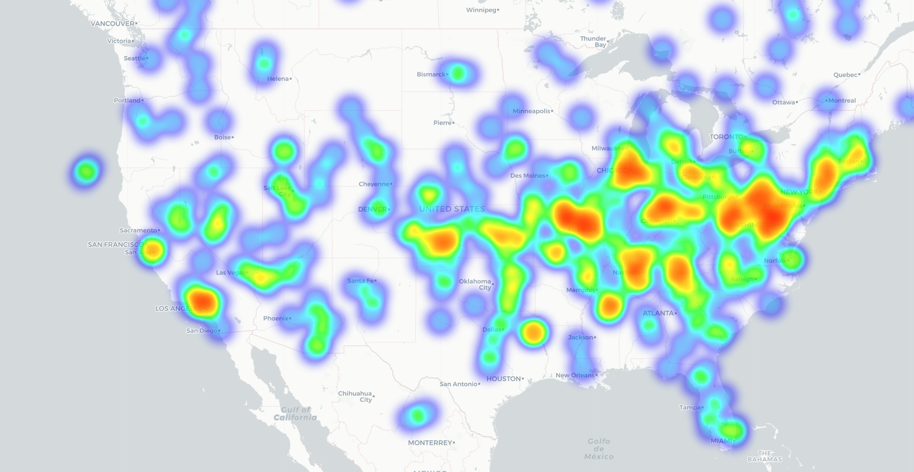

# BGP Heatmap of US

#### **Legend Explanation**

- **Heatmap Colors**: The colors in the map range from cool (blue) to warm (red). Blue represents areas with low BGP update activity, while red indicates regions with high activity.
- **Points**: Each point represents an Autonomous System (AS) with its location determined by querying its coordinates using the ASRank API.
- **Intensity**: The intensity of color at a given point corresponds to the frequency of BGP updates for that ASN. Higher frequencies yield warmer colors.

------

#### **Findings**

Key highlights from the heatmap include:

- The distribution of BGP update activity aligns closely with the population density of the United States.
- Hotspots of activity are concentrated around major metropolitan areas such as:
  - The Northeast Corridor (e.g., New York City, Boston, Washington, D.C.)
  - The West Coast (e.g., Los Angeles, San Francisco, Seattle)
  - The Midwest (e.g., Chicago, Detroit)
  - The South (e.g., Atlanta, Dallas)
- Sparse regions such as the Rocky Mountain areas and rural Midwest have significantly lower BGP update frequencies.

------

#### **Data and Methods**

**Data**:

- **Raw Input**: MRT-formatted files containing BGP update data collected from RIS (Routing Information Service).
- **ASN Data**: Mapped to coordinates and country information using the ASRank API.
- **Geospatial Base Map**: A map of the United States used for plotting ASN locations.

**Methodology**:

1. **Data Extraction**:

   - MRT files were downloaded and processed to extract BGP updates.
   - Each update was attributed to a specific Autonomous System Number (ASN).
     - **What is an ASN?** An ASN is a unique identifier assigned to a network or group of IP addresses under one organization (e.g., ISPs, universities, enterprises). It represents the administrative boundary of that network.
     - **Why ASNs Matter**: ASNs enable networks to exchange routing information via BGP, defining how data flows between different regions and networks.

2. **Protocol Context**:

   - What is BGP?

      The Border Gateway Protocol (BGP) is the internet’s core routing protocol. It facilitates communication between ASNs by determining the best paths for data to traverse.

     - Key Features of BGP:
       - Provides global internet connectivity by linking ASNs.
       - Optimizes data paths based on network conditions.
       - Enhances internet resilience through redundant routing options.
     - **Why BGP Updates Matter**: BGP updates occur when routing changes, reflecting network adjustments, traffic optimization, or issues like outages. Counting updates provides insights into network activity and health.

3. **Location Mapping**:

   - Using the ASRank API, ASNs were mapped to their geographic coordinates and country details.

4. **Visualization**:

   - BGP update frequencies were aggregated for each ASN and plotted as a heatmap on a geospatial base map.
   - Colors and intensities were scaled to represent the update frequency, highlighting regions of high activity.

#### **Significance Statement**

The presented heatmap is significant for multiple reasons:

- **Network Insights**: It provides a visual representation of regional internet activity and helps identify where BGP updates are concentrated. This can be a proxy for identifying high levels of network infrastructure and activity.
- **Correlation with Population**: The strong alignment with population density highlights the relationship between human activity and internet infrastructure.
- **Infrastructure Planning**: Policymakers, ISPs, and researchers can use this visualization to plan and optimize network infrastructure in underserved areas.
- **Resilience and Monitoring**: The map can also aid in monitoring network health and resilience by identifying regions with disproportionate BGP activity, which may indicate congestion or potential faults.

#### Github Link

https://github.com/XJC-git/BGPHeatMap

